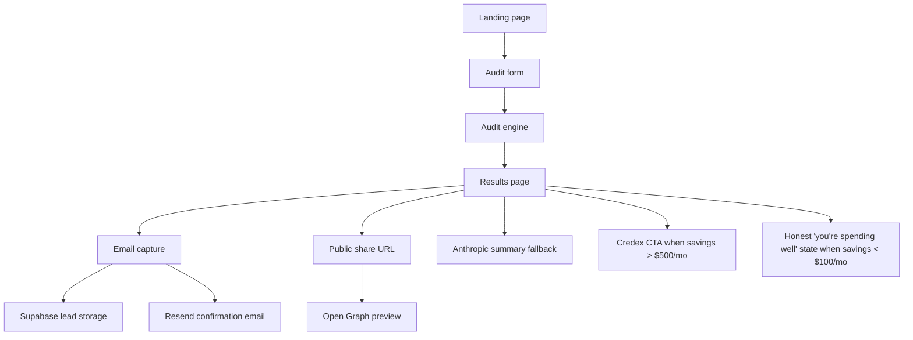

# ARCHITECTURE

## System Overview

SpendScope AI is a Next.js 15 App Router MVP that turns a user's current AI tooling stack into a defensible spend audit, then converts high-savings cases into Credex leads. The architecture favors deterministic audit math, explicit pricing sources, and shareable results over heavy backend state.

## What You're Building

A free web app that does this end-to-end:
1. A cold visitor lands on the page from a tweet, a blog post, or Hacker News.
2. They input what AI tools they pay for, what plan, monthly spend, team size, and primary use case.
3. They get an instant on-screen audit: where they’re overspending, what to switch to or downgrade, and total potential monthly + annual savings.
4. They get an option to capture the report with an email gate and, for high-savings cases, book a Credex consultation.
5. The result is shareable via a unique public URL with proper Open Graph previews.

No login is required to use the tool. Email is captured after value is shown, never before.

## MVP Features

### 1. Spend input form

Support at minimum these tools as of submission week:
- Cursor (Hobby / Pro / Business / Enterprise)
- GitHub Copilot (Individual / Business / Enterprise)
- Claude (Free / Pro / Max / Team / Enterprise / API direct)
- ChatGPT (Plus / Team / Enterprise / API direct)
- Anthropic API direct
- OpenAI API direct
- Gemini (Pro / Ultra / API)
- Windsurf or v0 — one additional tool of choice

For each tool, capture plan, current monthly spend, and number of seats. Also capture team size and primary use case (coding / writing / data / research / mixed). Draft state persists across page reloads so cold visitors can return without losing input.



## MVP Requirement Coverage

### Audit engine

The audit engine is deterministic and rule-based. For each tool row, it evaluates:
- Whether the current plan fits the team size and use case.
- Whether a cheaper plan from the same vendor would still satisfy the user.
- Whether a materially cheaper alternative with similar capability exists for the stated use case.
- Whether the user is effectively paying retail for functionality that could be sourced through AI credits or a lower-tier plan.

The logic stays defensible by tying every recommendation to a pricing source, a team-size assumption, and a one-sentence explanation. The audit engine does not try to "guess" preferences with AI; it uses current pricing data and explicit heuristics that a finance reviewer can follow.

### Results page

The results page is the product's shareable artifact and must be visually strong enough to screen-shot. It shows:
- A large hero with total monthly savings and total annual savings.
- A per-tool breakdown of current spend, recommended action, savings, and one-line rationale.
- A Credex-forward CTA when savings are above $500/month.
- An honest "You're spending well" message for already-optimized or low-savings audits.
- A lead capture prompt that still offers future optimization notifications when immediate savings are small.

The public version keeps the same layout but strips identifying details so the result can be safely shared externally.

### AI-generated personalized summary

The summary paragraph is the only part that uses an LLM. Anthropic is preferred, but the system must gracefully fall back to a templated summary if the API fails or is unavailable. The prompt lives in [PROMPTS.md](./PROMPTS.md), and the fallback ensures the audit result is never blocked by a third-party dependency.

### Lead capture + storage

Email capture happens only after the user sees value. Optional fields include company name, role, and team size. Leads are stored in Supabase, and a transactional email is sent through Resend to confirm the audit and mention Credex follow-up for high-savings cases. Abuse protection is intentionally lightweight for MVP: honeypot first, with rate limiting and hCaptcha as the next layer if traffic increases.

### Shareable result URL

Every audit produces a unique public URL. Identifying details such as company name and email are stripped from the public version, while the tools, pricing assumptions, savings numbers, and summary remain visible. Open Graph metadata is generated so the result renders cleanly on Twitter, LinkedIn, and messaging apps.

### Bonus features

The bonus work stays optional until the MVP is fully working:
- PDF export of the full report.
- Embeddable widget via a script tag.
- Benchmark mode showing per-developer spend versus peers.
- Referral codes for shared-audit growth loops.
- A short launch-thread or blog post draft for go-to-market use.

## Data Flow

1. **User lands on homepage** and clicks through to the audit form.
2. **User enters tools, plans, spend, team size, and use case** and the draft persists locally across reloads.
3. **Form submission sends normalized inputs to the audit engine**.
4. **Audit engine evaluates each tool** using plan-fit, cheaper-plan, overlap, and credits-versus-retail checks.
5. **Recommendations are assembled** into per-tool actions plus monthly and annual savings totals.
6. **The result is serialized into a token** so the private result page can be opened immediately without login.
7. **The results page renders** the hero savings summary, per-tool breakdown, and AI-generated summary.
8. **If the user submits email**, the lead is stored in Supabase and a confirmation email is sent through Resend.
9. **A public result URL is returned** with PII removed, Open Graph tags enabled, and the Credex CTA shown conditionally based on savings.
10. **A visitor who opens the public URL** sees the same audit insight and can start their own audit, closing the sharing loop.

## Stack Justification

| Component | Choice | Why |
|-----------|--------|-----|
| **Frontend Framework** | Next.js 15 App Router | SSR + static generation for SEO; API routes co-located; built-in optimization |
| **Language** | TypeScript (strict) | Type safety for audit logic; refactorability; team clarity |
| **Styling** | Tailwind CSS v4 + custom theme | Rapid UI build; custom dark palette for premium feel; CSS variables for consistency |
| **State Management** | Zustand + localStorage | Minimal bundle; offline-first form persistence; no Redux boilerplate |
| **Lead Storage** | Supabase | Managed PostgreSQL; simple server-side writes; easy to scale without introducing auth complexity into the audit flow |
| **Email** | Resend | Simple transactional API; reliable for confirmation emails and follow-up notices |
| **LLM Summary** | Anthropic API + fallback | Preferred for natural-language summaries; isolated from the audit math so the core result remains deterministic |
| **Deployment** | Vercel | Native Next.js optimization; auto-scaling; edge functions for future |

## Why Not...

- **React SPA (Vite):** Needs separate backend for lead storage + email; harder to iterate
- **Vue/Svelte:** Good options but smaller ecosystem; Next.js is faster to ship
- **Firebase:** Simpler than Supabase for this scale; chose Supabase for PostgreSQL SQL familiarity + open-source option later
- **Database-first architecture:** Would add complexity (auth, sessions, migrations). URL-encoded tokens eliminate DB for MVP.
- **One-shot LLM prompt for entire audit:** Rejected for cost and unreliability. Deterministic logic is defensible; LLM only does summary.

## Scaling to 10k audits/day

**Current bottlenecks:**
1. The audit engine is CPU-light, but pricing lookups and result serialization should stay fast.
2. Supabase writes and email sends become the first real backend pressure points.
3. The share-page and social preview path must remain stateless so traffic spikes do not depend on a database read.

**Changes for 10k audits/day:**
1. **Cache pricing data** in memory or Redis so lookups stay sub-millisecond.
2. **Queue email sending** so result generation does not wait on an external mail API.
3. **Add stronger rate limiting** with honeypots plus hCaptcha if bot traffic rises.
4. **Index lead tables** on created_at, verdict, and savings to keep reporting cheap.
5. **Split the summary generation path** so LLM failures never affect the deterministic audit result.
6. **Precompute comparison rules** for overlaps and tool families so recommendation checks remain effectively O(n) for the small stack sizes this product expects.

**Estimated infrastructure cost at 10k audits/day:**
- Vercel: $100/month (app + serverless traffic)
- Supabase: $500/month (writes + pooled connections)
- Resend: $100/month (transactional email volume)
- Redis or cache layer: $50/month
- **Total: roughly $750/month** at 300k audits/month, before human ops time.

## Database Schema (if scaling past MVP)

```sql
CREATE TABLE audit_leads (
  id UUID PRIMARY KEY DEFAULT gen_random_uuid(),
  email VARCHAR(255) NOT NULL,
  company_name VARCHAR(255),
  role VARCHAR(255),
  team_size INTEGER,
  audit_token TEXT, -- base64url encoded result
  share_url TEXT, -- public result URL
  verdict VARCHAR(50), -- over-spending, good, over-optimized
  monthly_savings DECIMAL(10, 2),
  annual_savings DECIMAL(10, 2),
  created_at TIMESTAMP DEFAULT NOW(),
  updated_at TIMESTAMP DEFAULT NOW()
);

CREATE INDEX idx_leads_created ON audit_leads(created_at DESC);
CREATE INDEX idx_leads_verdict ON audit_leads(verdict);
```

## Security Considerations

- **Secrets:** All API keys in `.env.local` (Supabase, Resend, Anthropic) — never in code
- **Public results:** No PII in URL token; company name + email stripped from public version
- **Rate limiting:** Email capture route has honeypot + future hCaptcha
- **CORS:** API routes scoped to same-origin; no data leakage to third parties
- **Input validation:** Audit form validates spend (positive numbers), team size (1–10k), tool selection (whitelist)

## Monitoring & Observability (Future)

- Vercel Analytics for page views + navigation
- Supabase Realtime for lead flow monitoring
- Sentry for error tracking (if LLM integration enabled)
- Custom dashboard: audits per hour, email capture rate, savings distribution

## Deployment Pipeline

```
git push → GitHub Actions CI
  ├─ npm run lint (ESLint flat config)
  ├─ npm run build (Next.js production build)
  └─ if pass → auto-deploy to Vercel
```

No manual steps; code merges to main trigger deployment.
